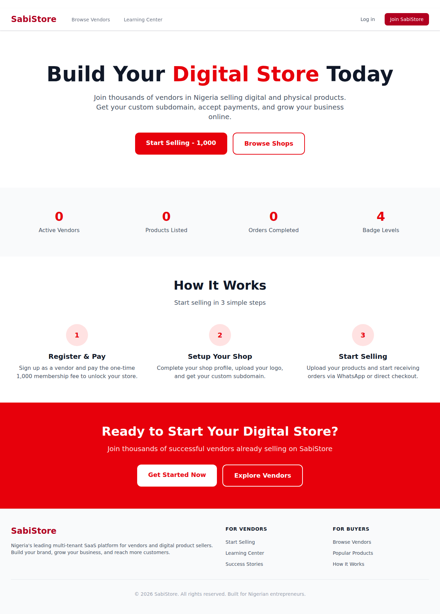

# SabiStore - Multi-Tenant E-commerce & Reseller Platform

SabiStore is a comprehensive, multi-tenant SaaS platform designed to empower vendors and entrepreneurs. It provides a robust ecosystem where vendors can create their own customizable online shops, manage products, handle orders, and engage with buyers. The platform integrates a complete wallet system, a reseller program with commission tracking, a learning center with courses and certifications, and a gamified badge system to reward vendor performance.

## Screenshot



## Key Features

- **Multi-Tenancy:** Each vendor gets a unique, customizable shop accessible via a dedicated subdomain (e.g., `your-shop.sabistore.com`).
- **Role-Based Access Control:** Distinct roles for Admins, Vendors, and Buyers, each with a tailored dashboard and permissions.
- **Shop Management:** Vendors can customize their shop's appearance, manage products, and view detailed analytics.
- **Product & Order Management:** Full support for physical and digital products, with a complete order tracking system from placement to delivery.
- **Integrated Wallet System:** Users can fund their wallets via Paystack and make seamless purchases on the platform. Vendors receive earnings directly into their wallets.
- **Reseller Program:** Users can become resellers for products, earning commissions on sales generated through their unique affiliate links.
- **Learning Center:** A built-in LMS where admins can create courses. Vendors can enroll, track their progress, and earn certificates upon completion.
- **Gamified Badge System:** Vendors are awarded badges (e.g., Bronze, Silver, Gold) based on their sales, number of products, and other performance metrics, encouraging engagement and building trust.
- **Secure Payments:** Powered by Paystack for reliable and secure transaction processing for both wallet funding and direct payments.
- **Admin Dashboard:** A central hub for platform management, including user administration, transaction monitoring, and site-wide settings.

## Getting Started

Follow these instructions to get a local copy of the project up and running for development and testing purposes.

### Prerequisites

- PHP (>= 8.2)
- Composer
- Node.js & npm
- A database server (e.g., MySQL, PostgreSQL)

### Installation

1.  **Clone the repository:**
    ```bash
    git clone https://github.com/your-repo/sabistore.git
    cd sabistore
    ```

2.  **Install PHP dependencies:**
    ```bash
    composer install
    ```

3.  **Install JavaScript dependencies:**
    ```bash
    npm install
    ```

4.  **Create your environment file:**
    ```bash
    cp .env.example .env
    ```

5.  **Generate an application key:**
    ```bash
    php artisan key:generate
    ```

6.  **Configure your `.env` file:**
    Update the following variables with your local environment details:
    - `DB_CONNECTION`, `DB_HOST`, `DB_PORT`, `DB_DATABASE`, `DB_USERNAME`, `DB_PASSWORD`
    - `PAYSTACK_PUBLIC_KEY`, `PAYSTACK_SECRET_KEY`
    - `APP_URL` (e.g., `http://localhost:8000`)

7.  **Run database migrations and seed the database:**
    The seeder will create sample users, shops, products, and other necessary data.
    ```bash
    php artisan migrate --seed
    ```

8.  **Compile frontend assets:**
    ```bash
    npm run dev
    ```

9.  **Serve the application:**
    ```bash
    php artisan serve
    ```
    The application will be available at `http://localhost:8000`.

### Development Helper Command

For testing purposes, you may need to quickly activate vendor memberships. A command has been created to facilitate this:

```bash
php artisan fix:vendor-dashboard
```
This command activates the membership for all vendors and patches a controller file to prevent type errors, making it easier to access vendor-specific features during development.

## Running Tests

To run the application's test suite, use the following Artisan command:

```bash
php artisan test
```

## License

The SabiStore platform is open-sourced software licensed under the [MIT license](https://opensource.org/licenses/MIT).